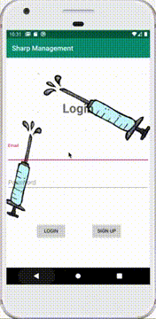

# DeltaHackVI-2020

## Overview: 
**App Name:** Sharp Management 
**Last Update:** Jan 26, 2020

## Team Members: 
1. **Zoe Ning** - McMaster University (Computer Science, Second Year) 
2. **Jiwoo Lee** - McMaster University (Computer Science, Second Year) 
3. **Jennie Li** - McMaster University (Computer Science, Second Year)
4. **Yuri Baziuk-Swaga** - Trent University (Computer Science, First Year)

## Description: 
This project was aimed to address solutions to the Health and Public Safety, Environmental and Productivity challenges from DeltaHacks VI 2020 hosted by McMaster University, Hamilton. The idea is to provide a GPS tracking application of your current location, along with custom database created in CSV format to inform the users of the nearest needle disposal facilities by calculating the shorted distance based on geo-coordinates.

This application is an Android App developed with Java in Android Studio for front-end, and Firebase (a mobile/web application platform) for backend.

## Demo:

## Features:
1. **User Authentication** — Upon launching, users need to either Login or Sign Up their accounts, which are done by Firebase authentication system. Once authenticated, the user is brought to the Main Menu, where they can select the following features. This feature was implemented for security and privacy.

2. **Find Nearest Needle Disposal Facilities** — First, retrieve the user’s location in latitude and longitude using the built in Location and LocationManager libraries. On top of that, we made our own database that contained information about the needle disposing facilities: [Name, Address, Postal Code, Phone Number, Email Address, Latitude, Longitude]. Then, we wrote our custom csv reader to read through the file and retrieve latitude and longitude. The algorithm for shortest distance given two geographic coordinates are computed according to https://www.movable-type.co.uk/scripts/latlong.html. Then, we retrieve the data for the facility that was nearest to you, and print out its information on the screen in the form of TextView.

3. **Report Needles That Are Not Properly Disposed Of** — There are two modes in this function — you can either choose to upload a photo of the non-properly disposed needles, or choose to take a photo within the app. The image is then saved to an ImageView on the screen, and this data gets transfer to the Firebase storage system, which is then meant to be transferred to the related organizations.

## Prerequisites:
1. Java Developing Environment
2. Android Studio

## How to run this project:
1. git clone the repo at https://github.com/JiwooL0920/DeltaHacks-VI-2020.git 
2. Import project to Android Studio Run emulator

## Conclusion:
Overall, this project was a satisfactory project for first/second time hackers — while it was a manageable project, it helped to address many areas of social problems such as health, safety, environmental, and improving city services.
